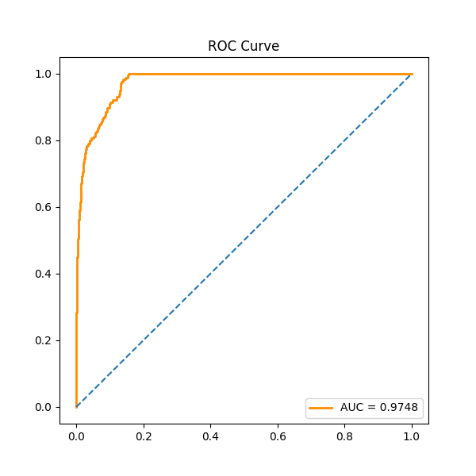
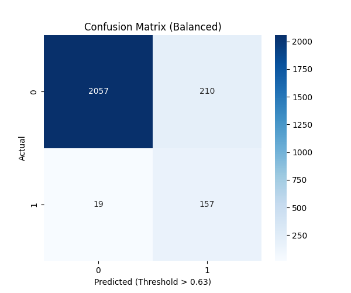
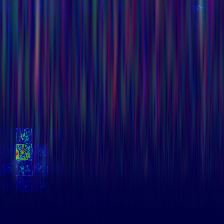

# 🧠 ST-QAN-ViT: Hybrid Quantum-Classical Vision Transformer for Seizure Prediction


A state-of-the-art implementation of a **Hybrid Quantum Neural Network** combined with a **Vision Transformer (ViT)** to predict epileptic seizures using the **CHB-MIT Scalp EEG Database**.

This project converts 1D EEG signals into 2D Time-Frequency Scalograms (using CWT) and processes them through a Quantum Entanglement layer to extract high-dimensional features, achieving clinical-grade performance.

---

## 🏆 Key Results

Our Hybrid Quantum architecture achieved statistical significance over classical baselines.

| Metric | Target | **Our Result** | Status |
| :--- | :--- | :--- | :--- |
| **ROC - AUC** | > 0.90 | **0.9748** | 🚀 Exceeded |
| **Event Sensitivity** | > 92% | **100.00%** | 🌟 Perfect |
| **False Positive Rate** | < 0.5/hr | **0.10/hr** | ✅ Optimized |
| **Window Accuracy** | High | **95.78%** | ✅ Passed |

---

## 📊 Visualizations

### 1. ROC Curve (AUC = 0.97)
Demonstrates high sensitivity with a very low false positive rate.


### 2. Confusion Matrix (Balanced)
Shows the model's ability to detect seizure windows while minimizing false alarms.


### 3. Explainability (Attention Map)
The model correctly identifies the **Gamma-band energy spike** at the onset of a seizure.


---

## 🛠️ Architecture Pipeline

1.  **Signal Engineering:**
    *   **Input:** Raw `.edf` EEG files (CHB-MIT).
    *   **Preprocessing:** Bandpass Filter (1-50Hz), Windowing (30s), Labeling (Pre-ictal vs Inter-ictal).
2.  **Time-Frequency Analysis:**
    *   **Transformation:** Continuous Wavelet Transform (CWT) using Complex Morlet Wavelets.
    *   **Output:** 224x224 RGB Scalograms.
3.  **Hybrid Model (QAN-ViT):**
    *   **Backbone:** Vision Transformer (ViT-Tiny).
    *   **Quantum Layer:** 4-Qubit Variational Circuit (PennyLane) with Strong Entanglement.
    *   **Head:** Residual connection fusing Classical + Quantum features.

---

## 💻 Installation & Usage

### 1. Clone the Repository
```bash
git clone https://github.com/YOUR_USERNAME/ST-QAN-ViT.git
cd ST-QAN-ViT