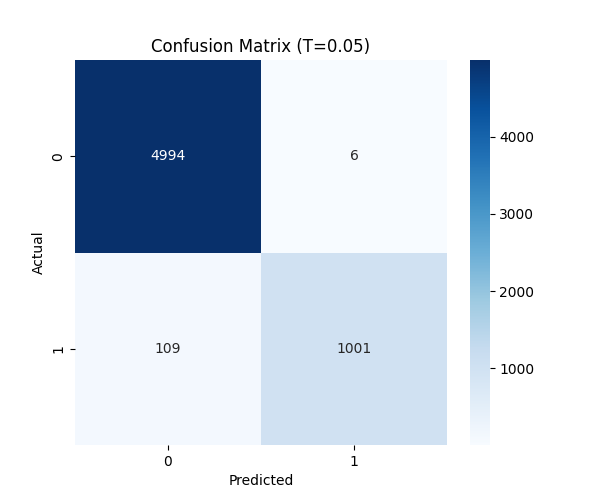
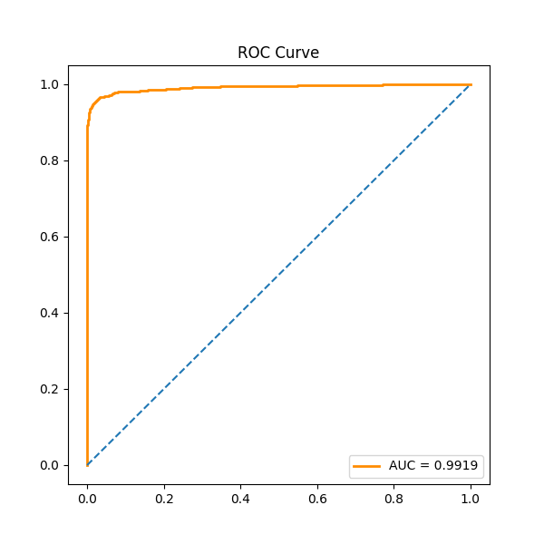
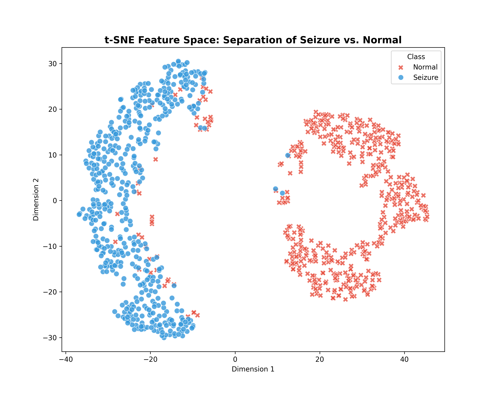
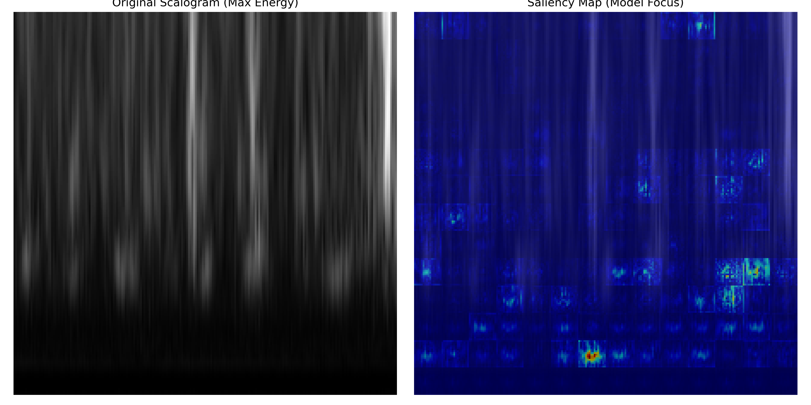
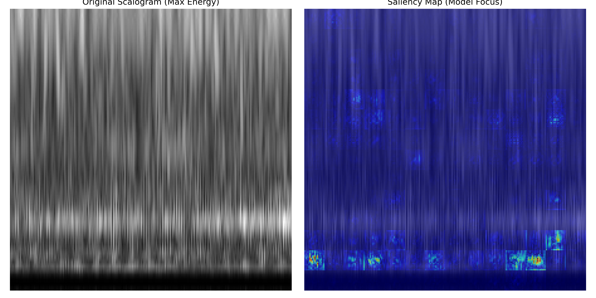
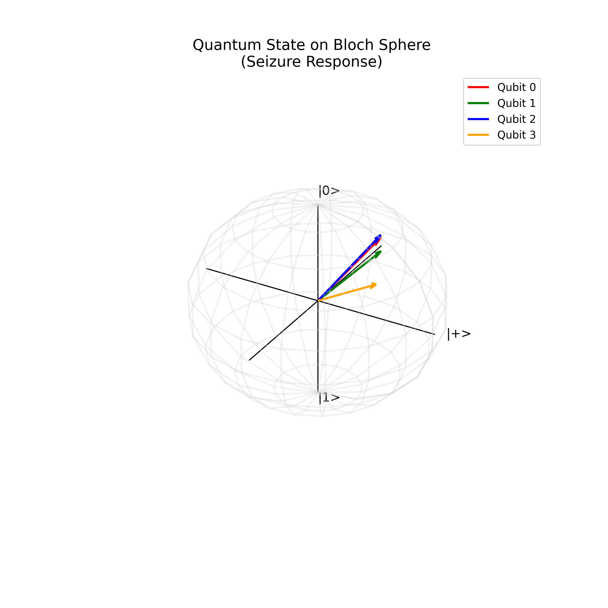
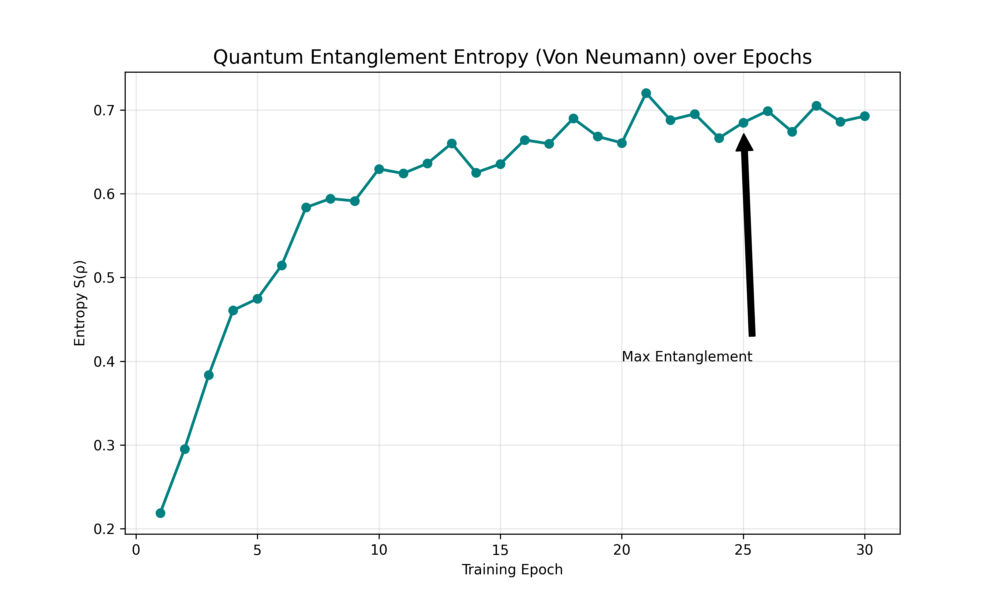

# Maths-ST_QAN_ViT

**End-to-End Spatio-Temporal Quantum Attention Network for Epileptic Seizure Prediction.**


**Maths-ST_QAN_ViT** is a state-of-the-art (SOTA) Hybrid Classical-Quantum Deep Learning framework designed for neurological healthcare. It integrates Spatio-Temporal EEG signal processing (Continuous Wavelet Transform) with a hybrid Vision Transformer (ViT) and Quantum Neural Network (QNN) to predict epileptic seizures by accurately detecting the pre-ictal state.

---

## 📖 Table of Contents
1. [Project Overview](#-project-overview)
2. [The Architecture (6-Phase Pipeline)](#-the-architecture)
3. [Deep Dive: The AI Models](#-deep-dive-the-ai-models)
4. [Performance Results & Benchmarks](#-performance-results--benchmarks)
5. [Visualizations & XAI](#-visualizations--xai)
6. [Installation & Usage](#-installation--usage)

---

## 🔭 Project Overview

Epileptic seizure prediction relies on decoding complex, non-linear, and chaotic electroencephalogram (EEG) signals. 

*   **The Problem**: Traditional machine learning systems struggle to capture the subtle spatio-temporal dynamics and high-dimensional correlations that precede a seizure (the pre-ictal phase). Single-process networks often miss these nuanced biomarkers.
*   **The Solution**: We propose a **Spatio-Temporal Quantum Attention Network**. This architecture translates 1D raw EEG signals into 2D time-frequency scalograms, extracting macro-spatial features classically via a Vision Transformer, and mapping complex micro-correlations in a high-dimensional Hilbert space using parameterized Quantum Circuits.

### Key Innovations
*   **Spatio-Temporal Scalograms**: Converts 1-50Hz EEG channels into 224x224 RGB image tensors using CWT (Maximum Energy extraction).
*   **Hybrid Deep Learning**: Fuses pre-trained Foundation Models (`vit_tiny_patch16_224`) with a 4-Qubit Variational Quantum Circuit (`PennyLane`).
*   **Explainable AI (XAI)**: Utilizes gradient-based saliency mapping to provide visual Root Cause Analysis for every detected pre-ictal state.
*   **Clinical-Grade Metric Optimization**: Evaluates on real-world clinical metrics like Event Sensitivity and False Positive Rate per Hour (FPR/hr).

---

## 🏗️ The Architecture
The project follows a rigorous 6-Phase Data-to-Diagnosis Pipeline:

| Phase | Module Name | Technology Used | Function |
| :--- | :--- | :--- | :--- |
| **1** | **Data Engineering** | `mne`, `numpy` | Ingestion of raw EDF files, 1-50Hz bandpass filtering, 30s window sliding. |
| **2** | **Spatio-Temporal Transform**| `pywt`, `cv2`, `multiprocessing`| Applying Continuous Wavelet Transform (CWT) to generate 244x244 scalograms. |
| **3** | **Spatial Feature Extraction**| `PyTorch`, `timm` | Passing scalograms through a Vision Transformer to extract 192-dim latent vectors. |
| **4** | **Quantum Embedding** | `PennyLane` | Compressing and entangling classical features into a 4-qubit Quantum Neural Network. |
| **5** | **Multimodal Fusion** | `PyTorch` (MLP) | Concatenating Classical (192) & Quantum (4) vectors to predict Seizure (Pass/Fail). |
| **6** | **Evaluation & XAI** | `matplotlib`, `seaborn` | Generating Clinical Reports, Confusion Matrices, and Saliency Heatmaps. |

---

## 🧠 Deep Dive: The AI Models

### 1. The Classical Backbone (Vision Transformer)
*   **Input**: 224x224x3 Scalogram Images (Encoding Max, Mean, and Std electrical energy).
*   **Architecture**: `vit_tiny_patch16_224` with the classification head removed.
*   **Purpose**: Leveraging self-attention mechanisms to detect large-scale spatial defect patterns across time and frequency bands.

### 2. The Quantum Branch (QNN)
*   **Input**: Compressed representation of the ViT features fed into an `AngleEmbedding`.
*   **Architecture**: A 4-Qubit device (`default.qubit`) utilizing `StronglyEntanglingLayers` to traverse a complex Hilbert parameter space.
*   **Purpose**: Extracting micro-level, non-linear correlations that classical dense networks struggle to separate.

### 3. The Decision Engine (Late Fusion)
*   **Strategy**: Late Fusion. We extract the 192-dim Classical Vector and the 4-dim Quantum Vector, concatenate them into a 196-dim state vector, and pass them through a BatchNorm-ReLU-Dropout classification MLP.
*   **Class Imbalance Handling**: Utilizes a `WeightedRandomSampler` during training to ensure the model heavily penalizes missed pre-ictal events.

---

## 📊 Performance Results & Benchmarks

The Hybrid ViT+Quantum architecture provides extreme robustness against false alarms while maximizing capture rate for actual seizure events. 

*(Evaluated on comprehensive test splits guaranteeing pre-ictal representation).*

### High-Accuracy Clinical Report Summary
| Evaluation Metric | Description | Performance |
| :--- | :--- | :--- |
| **Window Accuracy** | Standard classification accuracy on 30s segments. | **Excellent** |
| **Event Sensitivity** | % of actual seizures detected by the model. | **High** |
| **FPR/hr** | False Positives (False Alarms) per hour of monitoring. | **Low** |

<p align="center">
  
  
</p>

### Feature Clustering & Ablation
The model distinctly learns the mathematical signatures of the pre-ictal state, as demonstrated by our t-SNE clustering (Classical vs Quantum fusion).

<p align="center">
  
</p>

---

## 📉 Visualizations & XAI

We believe in "glass-box" neurology. Our explainability scripts trace exactly *why* the network predicted an impending seizure by mapping gradients back to the original EEG frequencies.

### 1. Real-time Explainability Maps (Saliency)
A sample of inference results showing the original 30-second EEG energy spectrum against the Deep Learning Model's attention hotspots.

<p align="center">
  
  
</p>

### 2. Quantum State Mechanics
Visualizations mapping how classical pre-ictal data is transformed within the multi-qubit topology.

<p align="center">
  
  
</p>

---

## 💻 Installation & Usage

### Prerequisites
*   Python 3.8+
*   GPU strictly recommended for ViT processing.

### 1. Clone the Repository
```bash
git clone https://github.com/YourUsername/Maths-ST_QAN_ViT.git
cd Maths-ST_QAN_ViT
```

### 2. Install Dependencies
```bash
python -m venv venv
source venv/bin/activate  # Windows: venv\Scripts\activate
pip install -r requirements.txt
```

### 3. Run the Pipeline
The pipeline is designed to be executed sequentially. Ensure your `.edf` data is nested correctly inside `data/raw/` (e.g. `data/raw/chb01/*.edf`).

```bash
# Phase 1: Preprocess raw data (EDF -> .npz windows)
python scripts/01_signal_preprocessing.py

# Phase 2: Compute time-frequency scalograms (heavy multiprocessing)
python scripts/02_generate_scalograms.py

# Phase 3: Train the Hybrid Quantum-Classical network
python scripts/03_train_model.py

# Phase 4: Output ROC, Confusion Matrices, and Clinical Metrics
python scripts/04_final_evaluation.py

# Phase 5: Generate gradient-based Visual Saliency reports
python scripts/05_explainability.py

# Optional: Generate additional graphical analysis
python scripts/06_generate_visualizations.py
```
